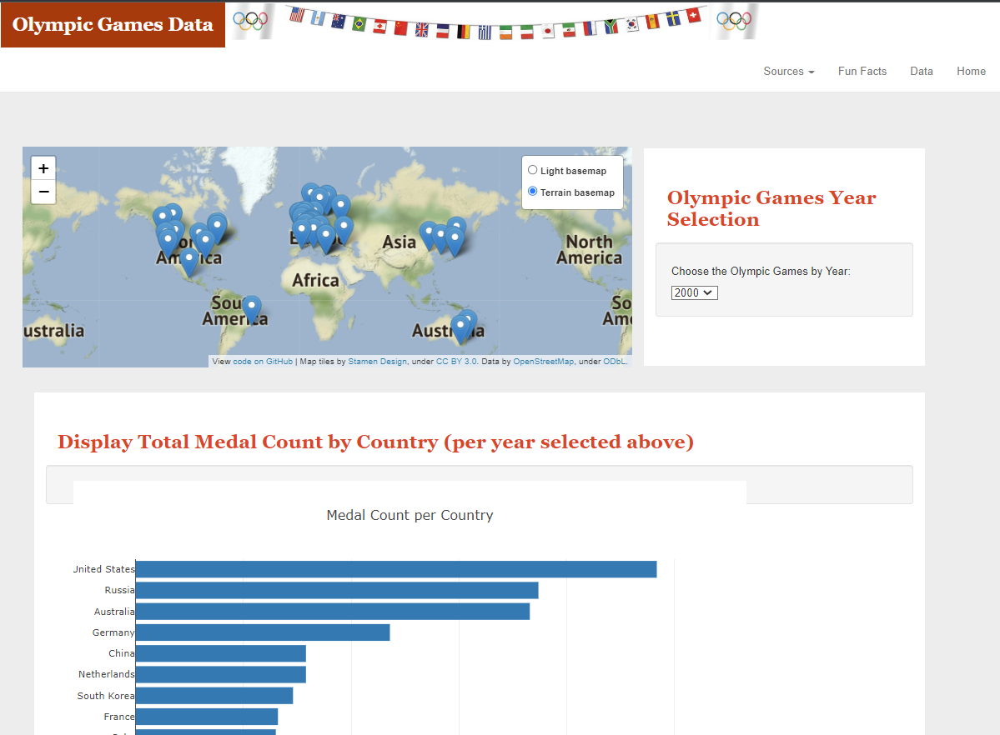
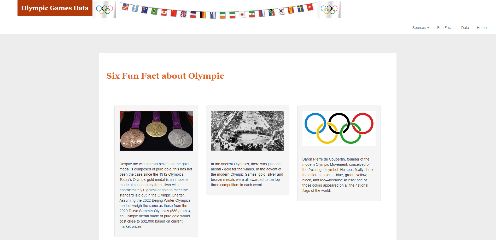

# From Athens to Beijing: Visualizing the World's Greatest Athletes
## Project Rationale
<p> We decided to pick a project that would showcase the global history of countries worldwide, coming together to one location, and having some good friendly competitions during the Summer and Winter Olympic Games. Our goal is to visualize some patterns throughout the Olympic Games history. Some of the patterns presented are as follows: </p>

* How many athletes and nations participated throughout the history of the Olympics 
* What were the demographics of the athletes:
    - Name 
    - Age
    - Country
    - Medal
    - Year
    - Sex
    - Height (cm) 
    - Weight (kg) 
    
* What sports were part of the Olympics throughout history
* Which countries won the most medals(gold, silver, and bronze) 
* What were the medal counts of all countries over time

## Resources
* <p><a href="https://github.com/OmodonMajiri/R-We-There-Yet-To-the-Olympics ">GitHub Repository</a></p>
* Datasets:
	- <a href="https://www.kaggle.com/datasets/heesoo37/120-years-of-olympic-history-athletes-and-results">120 Years of Complete Olympic History
  	- <a href="https://www.kaggle.com/datasets/jonscheaffer/olympic-host-cities">Olympic Host Cities</a>
 
## Group Members
* Andres Almarez
* Vedrana Basimamovic
* Michael Damas
* Gary Groscost
* Brian Hall
* Stephen Jackson
* Colleen Kearns
* Leon Lee
* Hee Oh
* Vinika Patel
* Bob Pickerel

## Home Page
### Landing Page
<p>Below, you can see the layout of our landing page which is comprised of our map, a drop down for selecting the year of the Olympics, and a display of total medal counts, athelete demographics, and medal counts of countries by year.</p>

	
### World Map
<p>The world map is located on the landing page showcasing all the markers for host cities throughout the history of the Olympics using the Carto and Color Terrain basemap based on Leaflet, JSON, and JS. If you hover over the marker, you will see the year that specific city hosted either the Summer or Winter Olympics.</p>


### Interactive Data
<p> There are two interactive data visuals on the landing page. One visual is a bar chart that represents the top 10 medal counts based on the year the user selects. The other is a line graph that represents the countries medal counts over the history of the Olympics.</p>
 

### Demographics of the Athletes
<p>In addition to the interactive data, we also included the demographics of all athletes that participated in the Olympics. We included their age, country, height, medal, name, sex, weight, and year they participated.</p>

	
### Fun Facts about the Olympics
<p>In addition to the data we displayed, we also were able to obtain some interesting facts about the Olympics that maybe not many people knew.</p>

<p>You can find the first website we used <a href="https://www.ef.edu/blog/language/24-facts-about-the-olympics/">here</a>.</p>
<p>You can find the second website we used <a href="https://champions-speakers.co.uk/news/14-cool-facts-about-olympics-you-might-not-know">here</a>.</p>

## Technologies used to build the Olympics Webpage:
```
- Database: MySQL 
- Data Visualization: Javascript | Plotly.js | D3.js | Highcharts
- Front-End: HTML | Bootstrap | CSS
- Back-End: Python Flask | SQLAlchemy
```
## Our Inspiration
<p>To help inspire our creative fodder, we referenced some visualizations that would help with the roadmap of how we wanted our project to flow. Here are some of the visualizations we found to guide in the process:</p>


  
	
<p>All images were downloaded from <a href="https://mediashift.org/2016/08/5-data-stories-olympic-games/">5 Data Stories You Can Tell about the Olympic Games</a></p>.

## Transformation Process
### Data Merging
<p> For this table, we combined both 120 Years of Complete Olympic History and the Olympic Host Cities data into one dataset where you can find <a href="working_dir/olympics_data.csv">here</a>.</p>
<p>We were able to successfully combine the data and were well on our way to using this data to create our website. Interesting fact, we noticed after we merged the data, there were 498 distinct "countries" that participated in the Olympics, a lot of them going by different names to represent a country.</p>

## Challenges
<p> Througout the project, there were a few stumbling blocks that we came upon. Some include the following but is not limited to:</p>
	
* Using Flask to serve up our data and realizing that Flask requires a primary key for a connection to the Postgres database.
* Using a rendered template in Flask as we needed to run the app V.S. using Visual Studio to run a live server.
* Staying coordinated and organized while working on the code because there were so many people. It was difficult to work on codes separately and come together to merge them.
